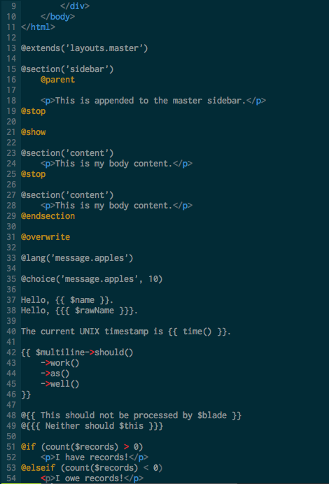
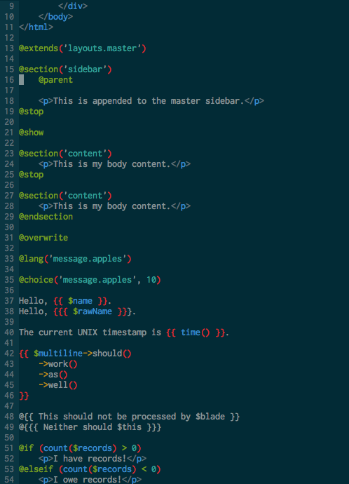

# vim-blade #

Vim syntax highlighting for Blade templates (Laravel 4).

Installation
------------

Using pathogen 
[pathogen.vim](https://github.com/tpope/vim-pathogen).  

    cd ~/.vim/bundle
    git clone git://github.com/xsbeats/vim-blade.git

Without vim-blade | With vim-blade
------------------|---------------
 | 

Todo
----
- Add blade specific indentation (if, endif, etc)
